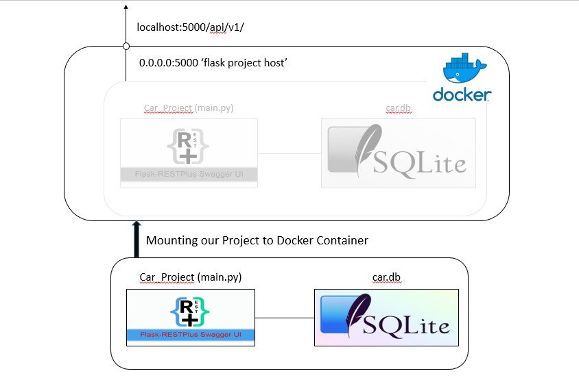
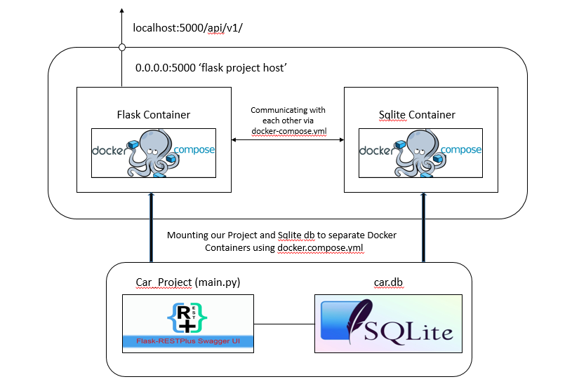

# Car_Project Flask API Application
A flask application which creates Python Flask-Restplus API, with SQLite db at the backend and contains Dockerfile and Docker-compose.yml for deployment of the application.

#### The basic goals set in this application are -It should be:

  - Unit/functionally tested
  
  - Stable
  
  - Secure
  
  - Maintainable.
  
#### In detailed goals achieved:

  - Used Flask-Restplus API package which does self documentation using Open API (Swagger) specifications. It gives us interactive 
          documentation.

  - Used SQLite relational database for the backend.

  - Writing an API to load a csv dataset which will be used to insert the records to my Sqlite db. In detailed discussion for this and 
     other APIs available in later part of this readme.

  - Testing with pytest

  - Using Firebase for the authentication. This can be later switched to JWT authentication or other basic authentication. Discussed 
     later in details.

  - Using Flask-SQLAlchemy for ORM operations

  - Used Flask-Migrate for the database migration on the go.

  - Dockerizing the application using Dockerfile for the API.

  - Using Docker-compose to run the API and the database in separate containers. 
      
### Dependencies

#### Important Project Dependencies

   - Python 3.6+
    
   - Sqlite3 (Relational Database)
    
   - flask-restplus (+ flask)
    
   - sqlalchemy (+ flask-sqlalchemy) - Database ORM.
    
   - alembic (+ flask-migrate)- for DB migrations.
    
   - Docker and Docker Compose (Their latest versions would be preferred)
    
   - Other than this run pip freeze > requirements.txt from the project

### How to Run the Project

 #### 1. From Pycharm
        
   - Install/Download all the above dependencies.
   - Create a database in you local folder and give it's path in the config file in the SQLALCHEMY_DATABASE_URI variable. 
      (Note: Here in this project I have attached the db (that I created) in the project itself and have given it's path. But this is just
             for quickly running this project. In actual, the good practice is to keep db on your local machine. So, when you download this
             project on your local machine then create a new db and give its path in config file to the variable stated above)
             
             So first you need to set Env Variable discussed in next point and do the migrations by running below commands in your project folder location:
                $ flask db migrate
                
                $ flask db upgrade
   - Set env variables for the flask application ( in pycharm terminal) : 
            
            Windows:
            
                $ set FLASK_APP=run.py
            
                $ set FLASK_CONFIG=development
            
            Linux:
                
                $ export FLASK_APP=run.py
                
                $ export FLASK_CONFIG=development
   - Run Docker ( type in Pycharm terminal)
                
                $ docker build -t car_project:latest . ( sudo can be use if user not set and be sure you put that . in last)
                
                $ docker run -d -p 5000:5000 car_project
   - Docker Compose ( you can also build and run the project through docker-compose command)
                
                $ docker-compose up --build ( one command to build and running project)
  
   - Open the Browser and type in browser
                
                http://localhost:5000/api/v1/ ( if you are running Docker)
                
                http://localhost:8000/api/v1/ ( if you are running docker-compose)
                
 #### 2. From Terminal
    
   - Go to the project folder directory
   - Run all the commands discussed above (Pycharm)
   
### Description of API

   - Note: You can use Swagger UI (after running on browser)/curl/Postman to run these endpoints.
   
 #### 1. http://127.0.0.1:8000/api/v1/cars/read_file (POST Request)
     
   - This api endpoint is used to upload the csv dataset file which gets read and executed in the project to insert the records in 
     the database.
     
   - Example of Request and it's response for this endpoint:
                
                Request:
                
                $ curl -X POST "http://127.0.0.1:8000/api/v1/cars/read_file" -H "accept: application/json" -H "Content-Type: multipart/form-data" -F "car_data=@car_data.csv;type=text/csv"
                
                Response:
                "File read successfully"
                
 #### 2. http://127.0.0.1:8000/api/v1/cars/{id} (GET Request)
     
   - This api endpoint is used to get the details of the car with specific id (1,2,3,4 or 5) passed as the parameter. I have used firebase-authentication api
     for showing the authentication example. 
   - For this project, you can give any string as token, but internally you can make valid changes to validate the token.
     ( I am not validating in this project. For details visit: https://firebase.google.com/docs/auth)
   - Example of Request and it's response for this endpoint:
                
                Request:        
                
                $ curl -X GET "http://127.0.0.1:8000/api/v1/cars/5" -H "accept: application/json" -H "Authorization: <your firebase access token>"
                
                Response:
                [
                  {
                    "id" : 5,
                    "make": "Peugeot
                    "model": "308",
                    "year": " 1998,
                    "last_updated": "2017-06-01T00:00:00+00:00",
                    "price": 100
                  }
                ]
                
 #### 3. http://127.0.0.1:8000/api/v1/cars/avg_price (POST Request)
     
   - This api endpoint is used to return a average price of the car by using combination of 'make' and 'model' of a car.
   - If the combination matches then only you will see the average_price. I am returning the response by grouping by "make" of car.
   - Example of Request and it's response for this endpoint:
                
                Request:
                
                $ curl -X POST "http://127.0.0.1:8000/api/v1/cars/avg_price" -H "accept: application/json" -H "Content-Type: application/json" -d "{ \"make\": \"Nissan\", \"model\": \"Micra\"}"
                
                Response:
                [
                  [
                    "Nissan",
                    366.666666666667
                  ]
                ]

### Architecture Diagrams for this Project

 ####  - Architecture_Diagram of this project using Docker

 ####  - Architecture_Diagram of this project using Docker-Compose

